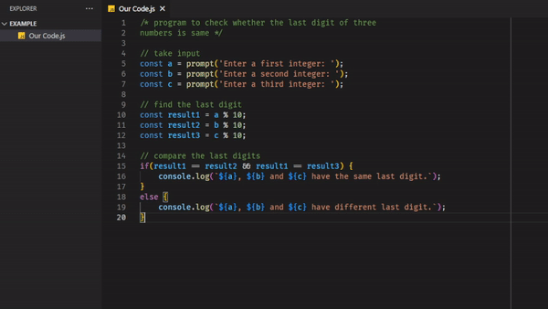

## Our Code - VS Code Extension

Simply _**Annoy**_ Other **Non-VSCode** Coders. By Sending Them A Randomly Injected Unicode Lookalike Character Code. 
**VSCode Supremacy** 😈

## Usage

Press `F1` or `CMD/CTRL + Shift + P` and Run the Command Name

**List of Command Names**

- Our Code: Space
- Our Code: Semicolon
- Our Code: Space Mayhem
- Our Code: Semicolon Mayhem
- Our Code: Good Luck

  

## Release Notes & Changelog

### v1.0.4

- Added Good Luck Command >:D
- Security Dependencies Hotfix
- Updated Extension To VSCode Engine v1.75.0

View the [Changelog](https://github.com/dwaneivan/vscode-our-code/blob/main/CHANGELOG.md)

## Issues

Report any issues on the Github [Issues](https://github.com/dwaneivan/vscode-our-code/issues) Page if you find any bug or have any suggestion.

## Contribution

Fork the [Repository](https://github.com/dwaneivan/vscode-our-code) and a submit pull requests.

**😈 Enjoy! 😈**