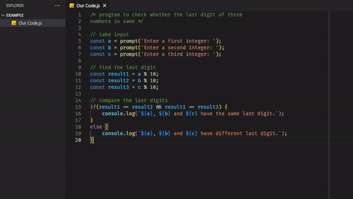

## Our Code

Simply _**Annoy**_ Other Coders.

## Usage

Press `F1` or `CMD/CTRL + Shift + P` and Run the Command Name

**List of Command Names**

- Our Code: Space
- Our Code: Semicolon
- Our Code: Space Mayhem
- Our Code: Semicolon Mayhem

  

> Tip: Because _**Visual Studio Platforms**_ have **Unicode Highlighting**, it works best for coders who doesn't use it.

## Release Notes & Changelog

### v1.0.1

Update Extension To Web Extension 

View the [Changelog](https://github.com/dwaneivan/vscode-our-code/blob/main/CHANGELOG.md)

## Issues

Report any issues on the Github [Issues](https://github.com/dwaneivan/vscode-our-code/issues) Page if you find any bug or have any suggestion.

## Contribution

Fork the [Repository](https://github.com/dwaneivan/vscode-our-code) and a submit pull requests.

**😈 Enjoy! 😈**